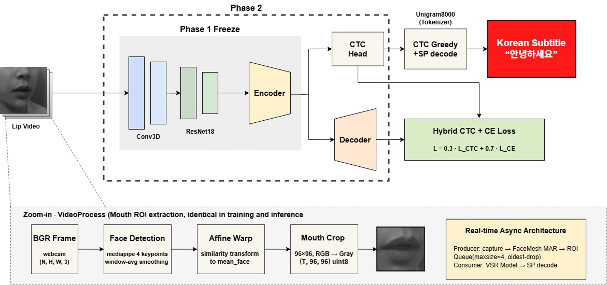
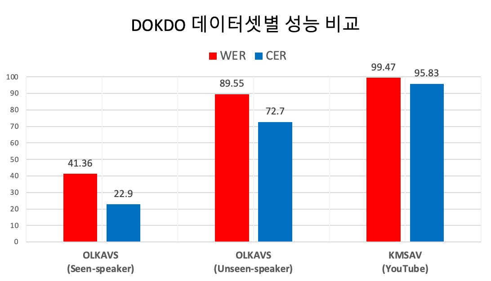

# DOKDO: Korean Visual Speech Recognition

Webcam-based Korean lip reading system. Recognizes Korean speech from lip movements only (no audio).

Built by transfer-learning [Auto-AVSR](https://github.com/mpc001/auto_avsr) (LRS3, WER 19.1%) with Korean datasets (OLKAVS, KMSAV). See our paper for details.

## Architecture



- **Frontend:** Conv3D + ResNet-18 visual feature extractor
- **Encoder:** 12-layer Conformer (768-dim), pretrained on LRS3 (English)
- **Decoder:** Hybrid CTC/Attention (L = 0.3 · L_CTC + 0.7 · L_CE)
- **Preprocessing:** MediaPipe face detection → affine warp → 96x96 grayscale lip crop
- **Training:** 2-phase transfer learning (Phase 1: encoder freeze + CTC head only → Phase 2: full fine-tune with differential LR)

## Training Data

| Dataset | Source | Size Used | Description |
|---------|--------|-----------|-------------|
| [OLKAVS](https://aihub.or.kr/aihubdata/data/view.do?currMenu=115&topMenu=100&dataSetSn=538) | AI Hub | ~1.5 TB | Studio-recorded Korean speech, multi-view, 1,107 speakers |
| KMSAV | ETRI | ~100 GB | Korean multimedia speech (YouTube) |

## Performance



| Dataset | WER (%) | CER (%) |
|---------|---------|---------|
| OLKAVS (Seen-speaker) | 41.36 | 22.9 |
| OLKAVS (Unseen-speaker) | 89.55 | 72.7 |
| KMSAV (YouTube) | 99.47 | 95.83 |

## Setup

### 1. Clone & install

```bash
git clone https://github.com/sangdeok-EE/DOKDO-VSR.git
cd DOKDO-VSR
pip install -r requirements.txt
```

> Python 3.9+, PyTorch 2.0+

### 2. Download files

| File | Where to place | Link |
|------|---------------|------|
| `korean_vsr_hybrid.pt` (~1 GB) | Project root | [Download](https://huggingface.co/dlvusgks/dokdo-vsr) |
| `model.json` (8 KB) | `benchmarks/LRS3/models/LRS3_V_WER19.1/` | [Auto-AVSR checkpoint](https://drive.google.com/file/d/1t8RHhzDTTvOQkLQhmK1LZGnXRRXOXGi6/view) |

### 3. Prepare tokenizer

**The tokenizer is not included in this repository.** You need to train your own SentencePiece Unigram tokenizer using your Korean speech dataset.

```python
import sentencepiece as spm

spm.SentencePieceTrainer.train(
    input='your_korean_transcripts.txt',   # one sentence per line
    model_prefix='unigram8000',
    model_type='unigram',
    vocab_size=8000,
    unk_id=0,
    bos_id=1,
    eos_id=2,
    pad_id=-1,
)
```

Place the trained `unigram8000.model` file in `pipelines/tokens/` and update the path in `configs/korean.ini`:

```ini
spm_model=pipelines/tokens/unigram8000.model
```

> **Note:** We used `vocab_size=8000` due to hardware constraints, but you can adjust this value to fit your setup. For best results, the tokenizer should match the vocabulary used during model training. If you use a different tokenizer, the model output may be degraded.

## Usage

```bash
python demo_webcam.py
```

| Key | Action |
|-----|--------|
| SPACE | Start / stop recording |
| q | Quit |

Recording stops → inference runs automatically → Korean text printed to console.

### Camera selection

```bash
CAMERA_INDEX=1 python demo_webcam.py
```

## Project Structure

```
├── demo_webcam.py              # Webcam demo
├── configs/korean.ini          # Model config
├── pipelines/
│   ├── model_korean.py         # Model loader
│   ├── pipeline_korean.py      # Inference pipeline
│   ├── data/                   # Preprocessing
│   ├── detectors/mediapipe/    # Face detection + lip ROI crop
│   └── tokens/                 # Place your tokenizer here
├── espnet/                     # E2E model architecture
├── Train/                      # Training code
│   ├── train.py                # 2-stage training script
│   ├── model.py                # KoreanVSRModel wrapper
│   ├── dataset.py              # PyTorch Dataset (.npz)
│   ├── preprocess.py           # Video → npz preprocessing
│   └── tokenizer_utils.py      # SentencePiece wrapper
├── assets/                     # Performance charts
└── requirements.txt
```

## Acknowledgements

- [Chaplin](https://github.com/amanvirparhar/chaplin) by Amanvir Parhar
- [Auto-AVSR](https://github.com/mpc001/auto_avsr) by Pingchuan Ma, Imperial College London
- [ESPnet](https://github.com/espnet/espnet)

## License

Apache 2.0

---

# DOKDO: 한국어 시각 발화 인식

웹캠으로 실시간 한국어 입모양 인식. 음성 없이 입술 움직임만으로 한국어를 인식합니다.

[Auto-AVSR](https://github.com/mpc001/auto_avsr) (LRS3, WER 19.1%) 사전학습 모델을 한국어 데이터셋(OLKAVS, KMSAV)으로 전이학습하였습니다. 자세한 내용은 논문을 참고하세요.

## 아키텍처


- **프론트엔드:** Conv3D + ResNet-18 시각 특징 추출기
- **인코더:** 12층 Conformer (768차원), LRS3 (영어) 사전학습
- **디코더:** Hybrid CTC/Attention (L = 0.3 · L_CTC + 0.7 · L_CE)
- **전처리:** MediaPipe 얼굴 검출 → 어파인 변환 → 96x96 흑백 입술 크롭
- **학습:** 2단계 전이학습 (1단계: 인코더 동결 + CTC 헤드만 학습 → 2단계: 전체 미세조정, 차등 학습률)

## 학습 데이터

| 데이터셋 | 출처 | 사용량 | 설명 |
|---------|------|--------|------|
| [OLKAVS](https://aihub.or.kr/aihubdata/data/view.do?currMenu=115&topMenu=100&dataSetSn=538) | AI Hub | ~1.5 TB | 스튜디오 녹화 한국어 음성, 다시점, 1,107명 화자 |
| KMSAV | ETRI | ~100 GB | 한국어 멀티미디어 음성 (YouTube) |

## 성능


| 데이터셋 | WER (%) | CER (%) |
|---------|---------|---------|
| OLKAVS (Seen-speaker) | 41.36 | 22.9 |
| OLKAVS (Unseen-speaker) | 89.55 | 72.7 |
| KMSAV (YouTube) | 99.47 | 95.83 |

## 설치

### 1. 클론 & 설치

```bash
git clone https://github.com/sangdeok-EE/DOKDO-VSR.git
cd DOKDO-VSR
pip install -r requirements.txt
```

> Python 3.9 이상, PyTorch 2.0 이상

### 2. 파일 다운로드

| 파일 | 위치 | 링크 |
|------|------|------|
| `korean_vsr_hybrid.pt` (~1 GB) | 프로젝트 루트 | [다운로드](https://huggingface.co/dlvusgks/dokdo-vsr) |
| `model.json` (8 KB) | `benchmarks/LRS3/models/LRS3_V_WER19.1/` | [Auto-AVSR 체크포인트](https://drive.google.com/file/d/1t8RHhzDTTvOQkLQhmK1LZGnXRRXOXGi6/view) |

### 3. 토크나이저 준비

**토크나이저는 이 저장소에 포함되어 있지 않습니다.** 한국어 음성 데이터셋을 사용하여 직접 SentencePiece Unigram 토크나이저를 학습해야 합니다.

```python
import sentencepiece as spm

spm.SentencePieceTrainer.train(
    input='your_korean_transcripts.txt',   # 한 줄에 문장 하나
    model_prefix='unigram8000',
    model_type='unigram',
    vocab_size=8000,
    unk_id=0,
    bos_id=1,
    eos_id=2,
    pad_id=-1,
)
```

학습된 `unigram8000.model` 파일을 `pipelines/tokens/`에 넣고, `configs/korean.ini`에서 경로를 수정하세요:

```ini
spm_model=pipelines/tokens/unigram8000.model
```

> **참고:** 저희는 하드웨어 제약으로 `vocab_size=8000`을 사용했지만, 환경에 맞게 조정할 수 있습니다. 모델 학습 시 사용된 어휘와 동일한 토크나이저를 사용해야 최적의 성능을 얻을 수 있습니다. 다른 토크나이저를 사용하면 모델 출력이 저하될 수 있습니다.

## 사용법

```bash
python demo_webcam.py
```

| 키 | 동작 |
|----|------|
| 스페이스바 | 녹화 시작 / 종료 |
| q | 종료 |

녹화 종료 시 자동으로 추론 → 인식된 한국어 텍스트가 콘솔에 출력됩니다.

### 카메라 선택

```bash
CAMERA_INDEX=1 python demo_webcam.py
```

## 프로젝트 구조

```
├── demo_webcam.py              # 웹캠 데모
├── configs/korean.ini          # 모델 설정
├── pipelines/
│   ├── model_korean.py         # 모델 로더
│   ├── pipeline_korean.py      # 추론 파이프라인
│   ├── data/                   # 전처리
│   ├── detectors/mediapipe/    # 얼굴 검출 + 입술 ROI 크롭
│   └── tokens/                 # 토크나이저를 여기에 넣으세요
├── espnet/                     # E2E 모델 아키텍처
├── Train/                      # 학습 코드
│   ├── train.py                # 2단계 학습 스크립트
│   ├── model.py                # KoreanVSRModel 래퍼
│   ├── dataset.py              # PyTorch Dataset (.npz)
│   ├── preprocess.py           # 영상 → npz 전처리
│   └── tokenizer_utils.py      # SentencePiece 래퍼
├── assets/                     # 성능 차트
└── requirements.txt
```

## 감사의 글

- [Chaplin](https://github.com/amanvirparhar/chaplin) -- Amanvir Parhar
- [Auto-AVSR](https://github.com/mpc001/auto_avsr) -- Pingchuan Ma, Imperial College London
- [ESPnet](https://github.com/espnet/espnet)

## 라이선스

Apache 2.0
